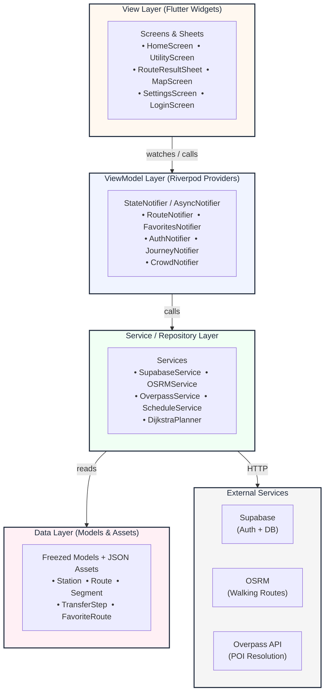

<div align="center">

# 🚇 Bangkok Transit Planner

### Navigate the City. Effortlessly.

A **Flutter application** for planning your journey across Bangkok's entire rail network — BTS, MRT, and Airport Rail Link — with real-time fare calculation, next-train countdowns, and crowd-level awareness.

[](https://flutter.dev)
[](https://dart.dev)
[](https://supabase.com)
[](https://www.openstreetmap.org)
[](https://riverpod.dev)
[](https://bangkok-transit-planner-dmta.vercel.app)

---


[**Try it on Web →**](https://bangkok-transit-planner-dmta.vercel.app)

</div>

---

## What is Bangkok Transit Planner?

Bangkok Transit Planner is a cross-platform Flutter app that takes the guesswork out of riding Bangkok's rail network. Whether you are rushing between platforms at a packed station or quietly planning your route from home, the app gives you the fastest path, the exact fare, and the direction to board — all in one place.

No more counting stops. No more guessing transfer gates. Just get on the right train.

---

## Features

### Route Planning Engine

- **Dijkstra algorithm** — finds the optimal path across the entire 7-line network in milliseconds.
- **Dual route modes** — choose between _Fastest_ (minimum stops/transfers) and _Cheapest_ (minimum total fare).
- **Multi-line transfers** — seamlessly handles interchanges between BTS, MRT, and ARL with correct transfer fees.
- **Boarding direction** — tells you exactly which end of the platform to stand on, e.g. _"toward Bearing"_ or _"toward Mo Chit"_.

### Fare & Schedule

- **Real fare tables** — calculates ticket prices using the actual fare matrices for every line.
- **Transfer surcharges** — includes inter-operator transfer costs automatically.
- **Next train countdown** — estimates the next departure based on each line's official schedule.

### Map & Location

- **Interactive map** — flutter_map with OpenStreetMap tiles, station markers, and route path overlay.
- **Custom location search** — resolve any place name (parks, malls, landmarks) to a routing coordinate via Overpass API.
- **Walking leg** — calculates the walking distance from your origin/destination to the nearest station using OSRM.
- **Accuracy warnings** — alerts you when a POI coordinate could not be precisely resolved (e.g. due to Overpass timeout).

### Social & Personalization

- **Favorites** — save frequently used routes and stations, synced to your account via Supabase.
- **Google Sign-In** — one-tap authentication.
- **Journey notifications** — active journey tracking with Lock Screen notifications on Android.
- **Crowd Level** — estimates platform congestion from passive GPS data and known peak-hour patterns.

### Design & Accessibility

- **Dark mode by default** — low-glare UI optimized for use in underground stations.
- **EN / TH bilingual** — full localization for both English and Thai interfaces.
- **Material 3 theming** — consistent token-based color system and typography across all screens.
- **High-contrast text** — automatic text color contrasting against colored line badges for readability.

---

## Under Active Development

> [!IMPORTANT]
> The following features are visible in the app UI but currently use **static mock data** or have logic that is **built but not yet field-tested**. The service layer and data models are fully implemented — real data integration and real-world validation are the remaining steps.

### 🚧 Transit Service Status

The **Utility** screen displays a service status dashboard for each rail line (Normal / Disrupted). The UI, line color theming, and status card layout are complete, but the data is currently served from a hardcoded list in [`transit_news_service.dart`](lib/services/transit_news_service.dart). Live status is planned to be fetched from an official or community-maintained API feed.

### 🚧 News & Announcements

The **Utility** screen shows a news and service alert feed. The bilingual card layout (EN/TH), date formatting, and line-color accent are all functional, but the articles are currently static mock data. Integration with a real news/alerts endpoint is planned.

### 🚧 Transit Card Type Selector

The **Utility** screen includes a card configuration panel for BTS Rabbit Card, MRT Card, and ARL Card — letting users set their card tier (Standard / Student / Senior / Trip Package) so fares are calculated with the correct discount. The UI, Riverpod state, SharedPreferences persistence, and Supabase cloud sync are all fully implemented. However, the actual discounted fare matrices for each card tier have not yet been applied to the Dijkstra planner — all routes currently calculate using the standard fare table regardless of the selected card type.

### 🚧 Live Journey Tracking (GPS-based Station Detection)

When a user starts a journey, the app subscribes to a live GPS position stream and advances the current station automatically when the device comes within 150 m of the next station (80 m for walking legs). The full pipeline — position stream, segment advancement, Lock Screen notification updates — is implemented in [`route_tracker.dart`](lib/providers/route_tracker.dart). This feature works correctly in simulation mode but has not yet been validated in a real on-train environment across all 7 lines.

### 🚧 Station Exit Coordinates Verification

The app uses [`station_exits.json`](assets/data/station_exits.json) to map the coordinate points of individual station exits. Currently, over 400 exits are flagged with `"source": "estimated"` (calculated or interpolated coordinates), meaning their precise lat/lng positions may slightly deviate from the actual physical gates. A validation effort is underway to replace these with verified coordinates from OpenStreetMap (OSM) or manual verification via Google Street View.

---

## Supported Lines

| Line              | Stations | Color     |
| ----------------- | -------- | --------- |
| BTS Sukhumvit     | 47       | 🟢 Green  |
| BTS Silom         | 14       | 🟢 Green  |
| BTS Gold          | 3        | 🟡 Gold   |
| MRT Blue          | 38       | 🔵 Blue   |
| MRT Purple        | 16       | 🟣 Purple |
| MRT Yellow        | 23       | 🟡 Yellow |
| Airport Rail Link | 8        | 🔴 Red    |

---

## Architecture

The app follows a strict **MVVM** pattern powered by Riverpod, with a feature-first folder structure that keeps UI, state, and data fully decoupled.



---

## Project Structure

```
lib/
├── core/
│   ├── constants/
│   │   ├── localizations/           # EN & TH translation classes
│   │   └── transit_colors.dart      # Line color tokens
│   ├── models/                      # Freezed data models (Station, Route, etc.)
│   └── router/                      # go_router configuration & guards
│
├── features/
│   ├── auth/                        # Login screen, Google Sign-In flow
│   ├── home/                        # Home screen, in-app notification banner
│   ├── search/                      # Station & place search
│   ├── route_result/                # Route result bottom sheet & timeline
│   ├── map/                         # Interactive flutter_map screen
│   ├── favorites/                   # Saved routes & stations
│   ├── settings/                    # Language, theme, offline map updates
│   └── utility/                     # Journey tracking overlay, shared widgets
│
└── services/
    ├── supabase_service.dart         # Auth + database operations
    ├── osrm_service.dart             # Walking route API client
    └── overpass_service.dart         # OpenStreetMap POI resolution

assets/
├── data/
│   ├── stations.json                 # Full station graph (coordinates, lines, fares)
│   └── schedule.json                 # Train schedule data per line
└── map_tiles.bundle                  # Pre-fetched offline map tiles (git-ignored)

bin/
└── generate_bundle.py                # Script to build the offline map tile bundle

.github/
└── workflows/
    └── deploy.yml                    # CI/CD: build Flutter web → deploy to Vercel
```

---

## Getting Started

### Prerequisites

- **Flutter SDK** `>=3.44.0`
- **Dart SDK** `>=3.12.1`
- **Python 3.x** (for generating the offline map bundle)
- A [Supabase](https://supabase.com) project

### 1. Clone & Install

```bash
git clone https://github.com/Full-Stack-boi/Bangkok-Transit-Planner.git
cd Bangkok-Transit-Planner

flutter pub get
```

### 2. Generate Code

Riverpod providers and Freezed models require code generation before the app compiles:

```bash
dart run build_runner build --delete-conflicting-outputs
```

### 3. Build the Offline Map Bundle

The map tile bundle is git-ignored and must be generated locally before the first run:

```bash
pip install requests Pillow
python bin/generate_bundle.py
```

### 4. Configure Environment

Copy the example config and fill in your credentials:

```bash
cp config.example.json config.json
```

```json
{
  "SUPABASE_URL": "https://your-project.supabase.co",
  "SUPABASE_ANON_KEY": "your-anon-key",
  "OSRM_BASE_URL": "https://router.project-osrm.org/route/v1/foot",
  "OVERPASS_BASE_URL": "https://overpass-api.de/api/interpreter"
}
```

### 5. Run the App

```bash
flutter run --dart-define-from-file=config.json
```

---

## How to Use

### Planning a Route

1. Open the app and tap the **search bar**.
2. Enter your **origin** — a station name or any place (park, mall, landmark).
3. Enter your **destination** in the same way.
4. Tap **Search** — the app resolves walking access points and calculates the optimal rail path.
5. The **Route Result Sheet** slides up showing:
   - Total fare and travel time
   - Step-by-step boarding instructions with line colors
   - Walking segments to/from stations
   - Next train departure time

### Switching Route Modes

Inside the result sheet, toggle between **Fastest** and **Cheapest** route to compare options before committing to a path.

### Saving Favorites

Tap the bookmark icon on any route result to save it. Favorites are synced to your Supabase account and accessible from the **Favorites** tab.

### Journey Mode

Start an active journey from the route result to receive **Lock Screen notifications** that update as you progress through each station segment.

---

## CI/CD

Every push to `master` triggers an automated build and deploy via GitHub Actions.

The workflow:

1. Caches and generates the offline map tile bundle.
2. Runs `build_runner` to generate Riverpod and Freezed code.
3. Builds Flutter Web with credentials injected from GitHub Secrets.
4. Deploys to Vercel via the Vercel CLI.

Set the following **GitHub Secrets** under _Repository → Settings → Secrets and variables → Actions_:

| Secret              | Description                          |
| ------------------- | ------------------------------------ |
| `SUPABASE_URL`      | Your Supabase project URL            |
| `SUPABASE_ANON_KEY` | Your Supabase anon / publishable key |
| `OSRM_BASE_URL`     | OSRM walking route server URL        |
| `OVERPASS_BASE_URL` | Overpass API endpoint URL            |
| `VERCEL_TOKEN`      | Vercel deployment token              |
| `VERCEL_PROJECT_ID` | Vercel project ID                    |
| `VERCEL_ORG_ID`     | Vercel organization / team ID        |

---

## Tech Stack

| Layer                | Technology                      | Purpose                                    |
| -------------------- | ------------------------------- | ------------------------------------------ |
| **UI Framework**     | Flutter 3.44                    | Cross-platform iOS, Android, Web, Windows, and Linux |
| **State Management** | Riverpod 3 + riverpod_generator | MVVM providers with code generation        |
| **Backend & Auth**   | Supabase                        | PostgreSQL database + Google OAuth         |
| **Routing Engine**   | Custom Dart (Dijkstra)          | Shortest/cheapest path across 7 lines      |
| **Map**              | flutter_map + OpenStreetMap     | Interactive station map with route overlay |
| **Walking Routes**   | OSRM                            | Turn-by-turn pedestrian routing            |
| **POI Resolution**   | Overpass API                    | Resolve place names to GPS coordinates     |
| **Navigation**       | go_router                       | Declarative deep-link routing              |
| **Models**           | Freezed + json_serializable     | Immutable, type-safe data models           |
| **CI/CD**            | GitHub Actions + Vercel         | Automated build and deployment pipeline    |

---

## Testing

```bash
flutter test
```

The test suite covers:

- **Unit Tests** — Dijkstra path correctness, fare calculation, multi-line transfer logic across the full 7-line graph.
- **Widget Tests** — Tab navigation rendering, mock Riverpod provider injection, UI state transitions.
- **Integration Tests** — Station entrance resolution via Overpass API with timeout and fallback handling.

All **32 tests pass** on the current codebase.

---

## License

This project is licensed under the **[PolyForm Noncommercial License 1.0.0](https://polyformproject.org/licenses/noncommercial/1.0.0)**.

You are free to view, use, modify, and share this software for **noncommercial purposes only**. Commercial use is not permitted without explicit written permission from the author.

---

<div align="center">

**Made by [Nattawut Buphoo](https://github.com/Full-Stack-boi)**

</div>
